# Linux-labs
This repository contains Linux Labs for Devops &amp; Cloud Engineers
# Create app.log,auth.log,system.log files

***touch app.log,auth.log,system.log***

# PART 1 — FIND COMMAND
# Task 1
Find all .log files.

***find . -name "*.log"***(for logs in the current directory)

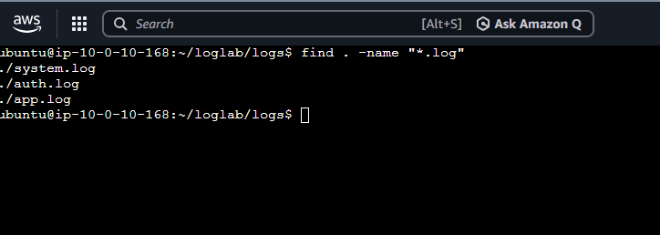

# Task 2
Find only files containing “app” in filename.

***find . -type f -name "*app*"***

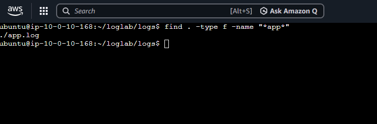

# Part 2 Locate Command 

# Task 3
Locate auth.log.

***locate auth.log***

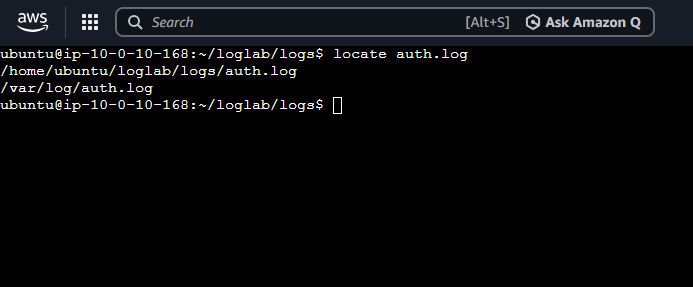

# Part 3: Grep Command 
# Task 4
Find all ERROR messages in app.log.

***grep"ERROR" app.log***

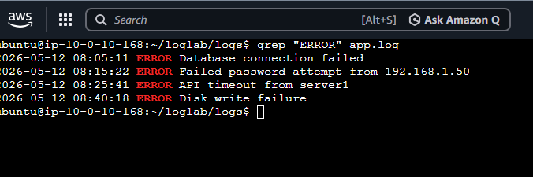

# Task 5
Find all WARNING messages.

***grep "WARNING"app.log***

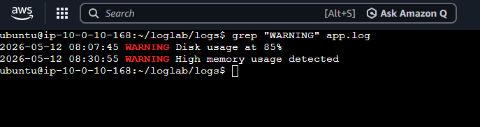

# Task 6
Count the number of ERROR entries.
Hint
Use piping with:
wc -l

***grep "ERROR" app.log| wc -l***

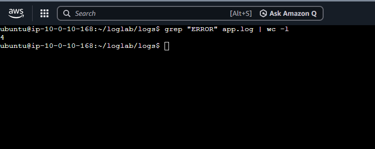

# Part 4 :AWK Command 
# Task 7
Print only timestamps from app.log.

***awk '{print$ 2}' app.log***

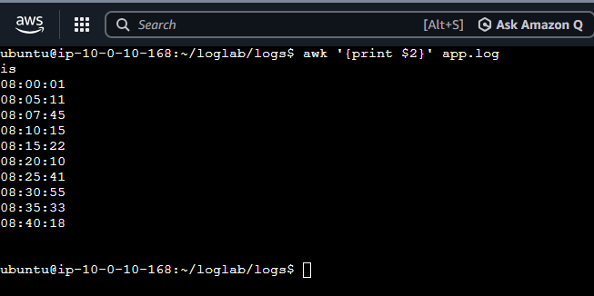

# Task 8
Print only usernames from successful login entries.

***awk 'NR==2 || NR==5' auth.log***

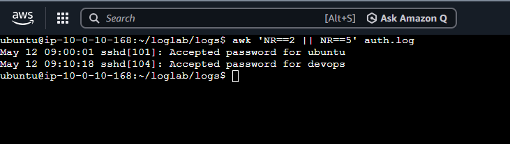

# Task 9
Extract disk usage percentages from system.log.

***awk 'NR==3 || NR==6' system.log**

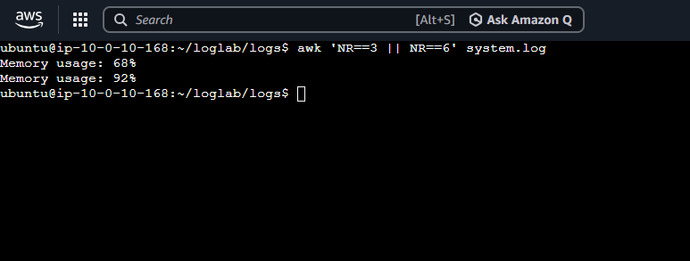

# Part 5 -piping 
# Task 10 
Find ERROR logs and count them.

***grep -i "ERROR" app.log | wc -l***

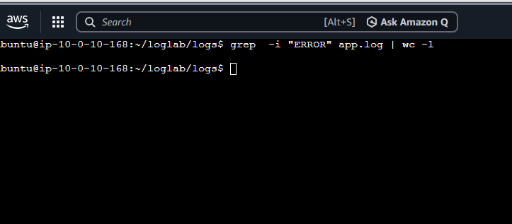

# Task 11
Extract usernames and sort alphabetically.

***cut -d: -f3 app.log | sort***

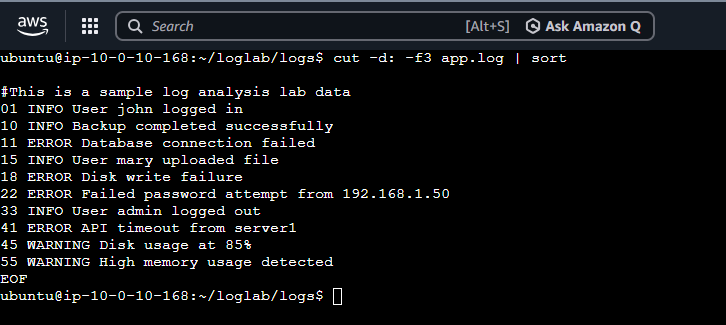

